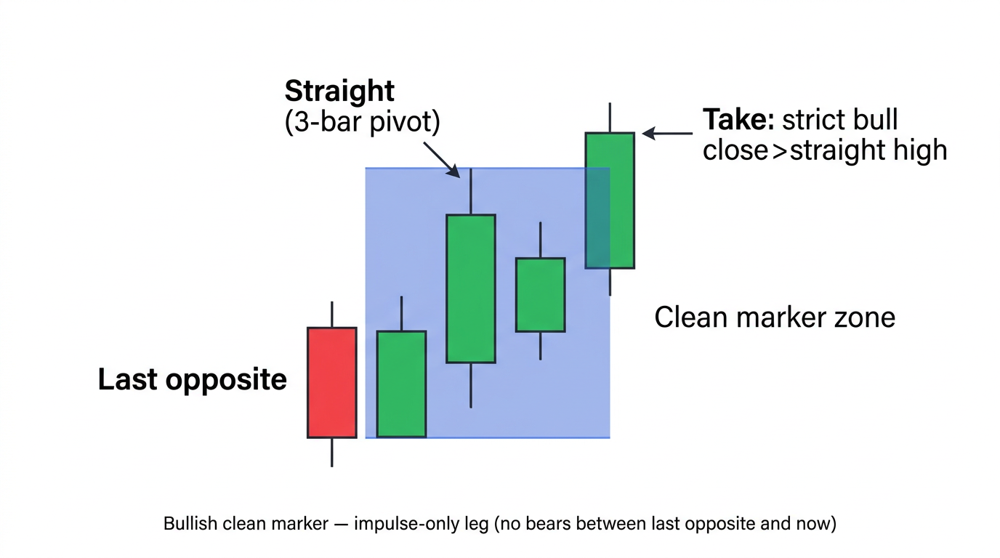
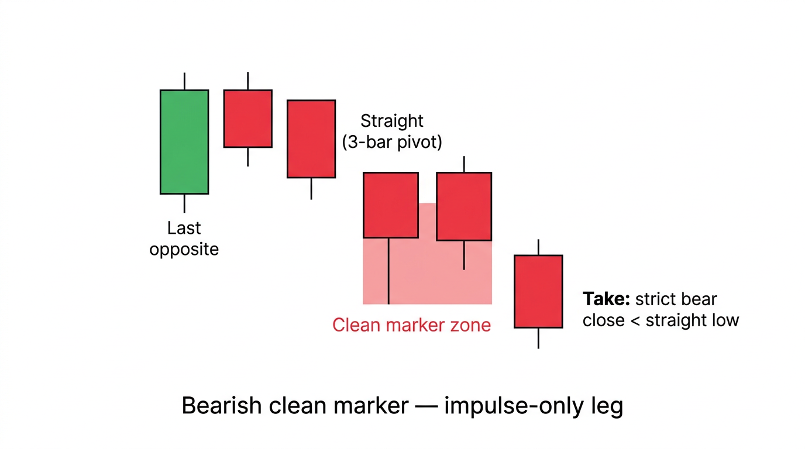
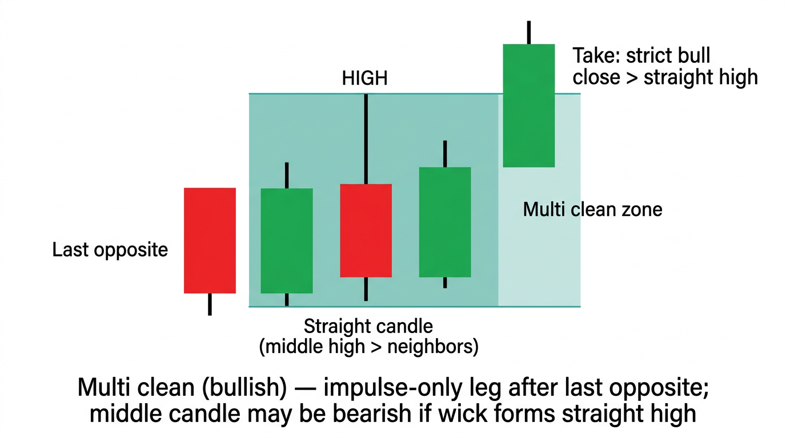
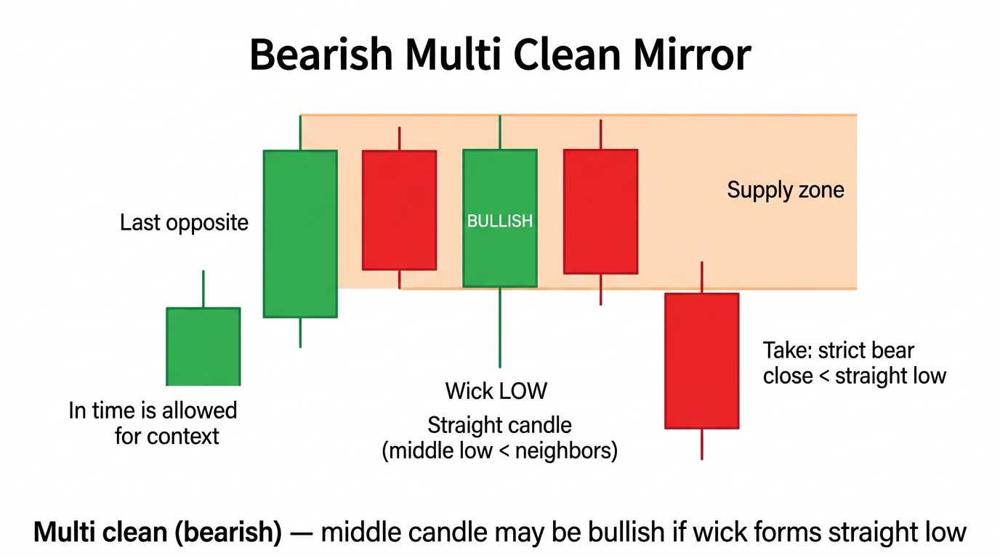

# Order Block Indicator (Zone 2.0)

TradingView **Pine Script v5** indicator and related **MT5** reference code for drawing and managing order-block style zones after breaks of structure (BOS).

## What this indicator does

The script marks **supply/demand-style zones** on the chart when price **closes through** the last opposite candle’s wick-adjusted level (**BOS**). Several **independent pipelines** can each draw rectangles (and optional labels):

| Piece | Meaning |
|--------|--------|
| **BOS** | **Break of structure**: confirmed close beyond the wick-adjusted high (bullish) or low (bearish) of the **most recent opposite-color** candle. This is what **starts** the clean/multi-clean marker scans. |
| **General OB** | Uses the **last opposite** candle’s zone → confirm → sweep / partial break → “General OB” box. |
| **Clean marker** | **3-bar straight wick pivot** (middle high/low vs neighbors). **All three** candles must be **strict** impulse (bull: `close > open`, bear: `close < open`). From the **last opposite** candle before the pivot through the current bar, the leg must be **impulse-only** (e.g. no bearish bars in a bullish clean leg); if that fails, **no Clean box** — use **Break marker** instead. **Take** = **confirmed** close through the straight level on a **strict** impulse bar. **INV** still applies (first bar after “candle 3” must not be the wrong color). Zone uses **pivot** wick/body rules (body cap when the pivot wick clears the next bar). Impulse bound = min low / max high from the **straight candle** through the current bar (then updated in WAIT). |
| **Multi clean** | **3-bar straight wick** (middle high/low vs neighbors); middle candle **can** be any color. **Only** bars **after** the last opposite before the pivot: the leg through the current bar must be **impulse-only** (no bears in a bull run — otherwise no Multi clean box, use **Break marker**). The **oldest** bar of the 3-bar fractal must lie **strictly after** that opposite. **Take** = **confirmed** close through the straight high/low on a **strict** impulse bar. Optional **prefer pivot that confirms first**; optional **skip INV** (first bar after the pivot triple). |
| **Break marker** | Own pipeline: after a BOS **slot**, stack **opposite** wicks → impulse breaks the reference cluster → “Break marker” box. **Not** the same as Multi clean. |
| **Mitigation** | Price **touches** a stored zone → optional mitigated alert; box can be faded or deleted. |
| **HTF touch** | Optional alert when a **completed higher-timeframe** candle’s range overlaps any stored zone. |

**Wick rules:** Zones can be trimmed when a wick **clears the next bar**; pivot candles use a **body-edge** cap when the rule applies.

**Display:** By default, **region guide**, **box name labels**, and **A–D map letters** are off so **boxes stay visible**. Turn them on in settings if you want the legend or Multi clean A/B/C/D mapping.

**Clean vs Multi clean (summary):** Both use a **3-bar straight wick** (middle high/low vs neighbors), an **impulse-only** leg from the **last opposite** before the pivot through the current bar (otherwise **no** box in that pipeline — use **Break marker**), **closed-bar take** through the straight level on a **strict** impulse bar, **distance** gating, and **mitigation** on zone touch. **Clean** additionally requires **strict** impulse on **all three** fractal candles and always uses the **INV** rule. **Multi** allows **any** color on the middle candle; the **oldest** fractal bar must be **strictly after** that last opposite; **INV** can be skipped via input (Pine: `mcmSkipInvalidCandleRule`). **Prefer pivot that confirms first** is **Pine-only** (not in the MT5 port).

## Clean marker examples (schematic)

Reference diagrams (not a live chart). These illustrate **Clean marker**: **strict** impulse on **all three** fractal candles.

**Bullish (demand-style zone)**

**Bearish (supply-style zone)**

## Multi clean marker examples (schematic)

Same **3-bar straight wick** idea, but the **middle** candle **may** be the “wrong” body color if **wicks** still make it the straight high (bull) or straight low (bear). The run after **last opposite** must stay **impulse-only**; the **oldest** fractal bar sits **strictly after** that opposite. **Take** is still a **strict** bull/bear **close** through the straight level.

**Bullish (demand-style zone)**

**Bearish (supply-style zone)**

## Files in this repo

| Path | Description |
|------|-------------|
| `OrderBlockZoneIndicator.pine` | Pine v5 source — paste into TradingView **Pine Editor** → **Add to chart**. The `indicator(...)` title line shows the version (e.g. V1.4.28). |
| `mt5/OrderBlockZone2.mq5` | MetaTrader 5 port (**v1.55** in `#property version`). **Clean** and **Multi clean** follow the same rules as Pine for straight fractal, impulse-only leg, triple-after-opposite (Multi), pivot wick zone, and strict take close. **Not** ported: Multi clean **“prefer pivot that confirms first”** (Pine input `mcmPreferConfirmFirst`). |
| `img/clean-marker-bullish-example.png` | Schematic: bullish clean marker (strict triple, zone, take). |
| `img/clean-marker-bearish-example.png` | Schematic: bearish clean marker (strict triple). |
| `img/multi-clean-bullish-example.png` | Schematic: bullish multi clean (middle may be opposite-color body if wick forms straight high). |
| `img/multi-clean-bearish-example.png` | Schematic: bearish multi clean (middle may be opposite-color body if wick forms straight low). |
| `img/chart.PNG` | Optional live-style screenshot for documentation. |

## How to use

**TradingView**

1. Open **Pine Editor** → create indicator → paste contents of `OrderBlockZoneIndicator.pine`.
2. **Save** / **Add to chart**.
3. Adjust **inputs**: toggle General / Clean / Multi clean / Break markers, **max distance** (pips), Multi clean strict mode / INV skip / confirm-first, mitigation, HTF zone-touch alerts.

**MetaTrader 5**

1. Copy `mt5/OrderBlockZone2.mq5` into your `MQL5/Indicators` folder and compile in **MetaEditor**.
2. Attach **OrderBlockZone2** to a chart; set inputs to match how you use the Pine script (see file header comments).

## Requirements

- TradingView plan that supports the script’s **max boxes / labels / bars back** (see `indicator(...)` in the Pine file).

## License

Use and modify as needed for your own trading; no warranty is implied.
